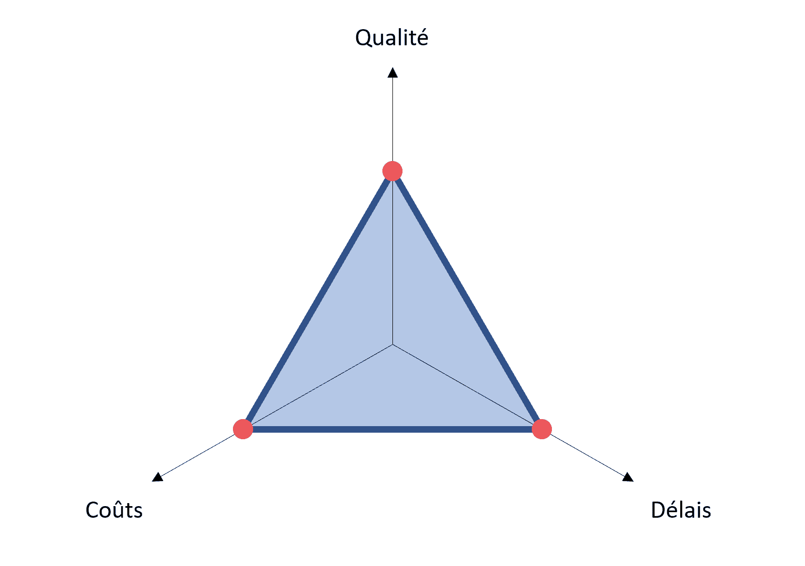
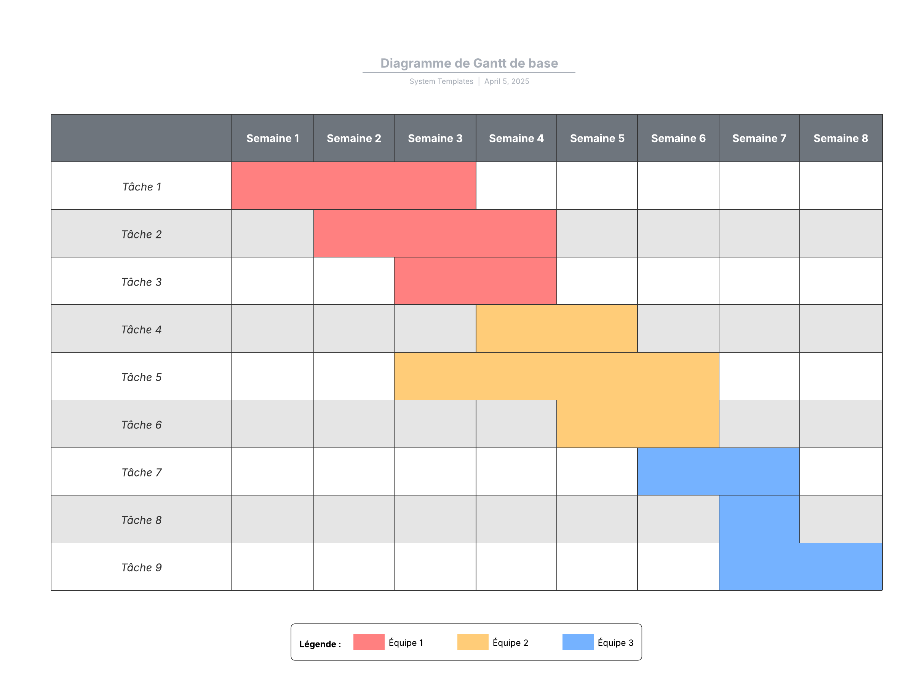
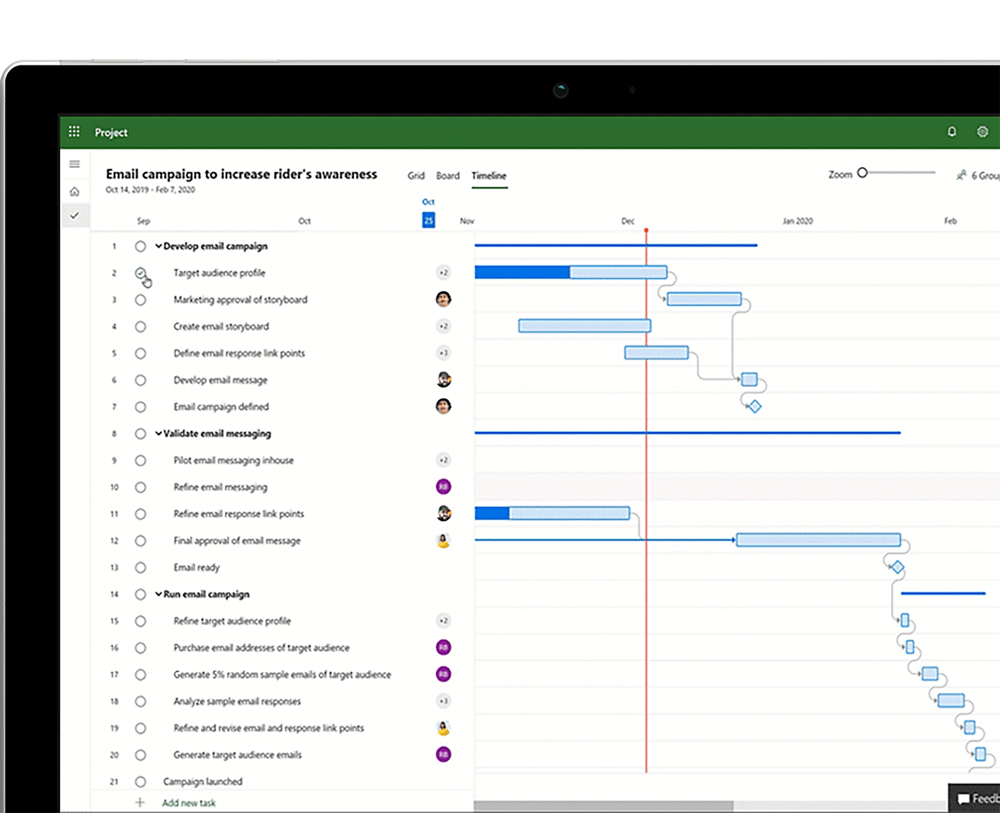
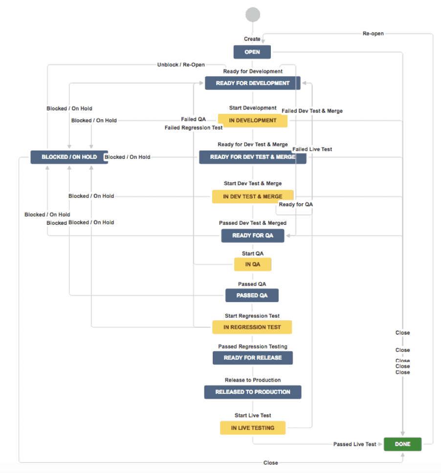
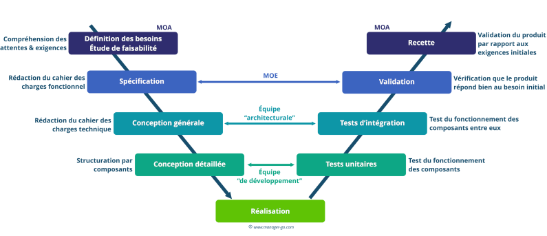

# Jour 40 - Vendredi 20 Juin 2025

*Voir daily Jour 40*

<ins> **Objectif d'un projet** </ins> 

Se résume en 3 mots : Qualité, Coûts, Délais (triangle QCD, triangle d'or)

<ins> **Cycle de vie d'un projet** </ins> 

**INITIALISATION**       
Idée - Besoin

**PLANIFICATION**   
Définition des tâches - Répartition des tâches - Etablissement des délais

**EXECUTION**   
Réalisation des tâches par les équipes  

**SUIVI/CONTRÔLE**      
Suivi des étapes du projet

**CLÔTURE**     
Important de faire le bilan du projet

  

<ins> **Outils** </ins> 

**Diagramme de Gantt**

MS Project 

  

**JIRA**    
Outils de ticketing 

**Le Workflow**     

  

<ins> **Rôles et responsabilités dans un projet** </ins>   
  
    Client  
Chargé d'affaires & Finance
       
  Chef de projet    
Analyste développeur    
DBA (Database Analyst)   
    Développeur   
      Testeur    
    Scrum Master

Ce dernier bloc constitue l'équipe de projet

<ins> **Méthode agile vs méthode traditionnelle (cycle en V)** </ins>   

**Cycle en V**

https://www.manager-go.com/gestion-de-projet/cycle-en-v.htm     

        

  

**Méthode agile**       
Organisée autour d'itérations appelées **sprints**

